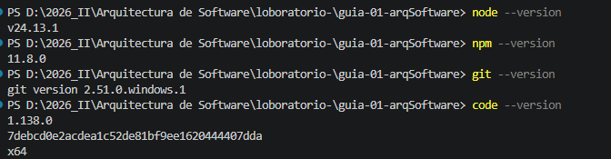

# Guía 01 - Arquitectura de Software

## Datos del estudiante

**Nombre:** DHEAN JHONER FERNANDEZ PILLMAN

**Curso:** Arquitectura de Software (IS-488)

**Docente:** Ing. Lizbeth Jaico Quispe

## Descripción del curso

El curso de Arquitectura de Software permite comprender las decisiones
estructurales necesarias para diseñar sistemas de software mantenibles,
escalables y organizados.

## Expectativas del curso

Mis expectativas son fortalecer mis conocimientos sobre diseño de
arquitecturas de software, organización de proyectos, patrones
arquitectónicos y buenas prácticas para desarrollar sistemas más
profesionales.

# Evidencias

## Ejercicio 01: Verificación del entorno

## Ejercicio 02: Creación del repositorio y estructura base

